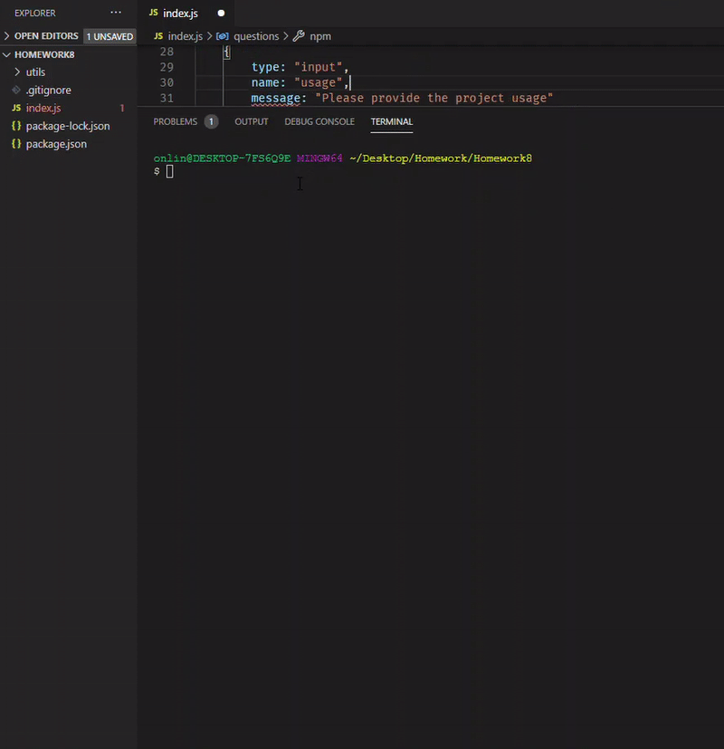

# ReadMe Generator
  kutsarb

  ## Project Name

  ReadMe Generator

  ## Description

  Simple readme.md generator created to help with creating a file describing a project, instructions on how to use, and other quality items for a proffesional looking readme file

  ## Table Of Contents

      [Description](#Description)
      [Installation](#Installation)
      [Usage](#Usage)
      [Licence](#Licence)
      [Contributors](#Contributors)
      [Test](#Test)

  ## Installation

  Download the files for the readme generator and place them in one folder. Run npm install in the terminal to download required modules. Run "node index" to start writing your readme. Once the final prompt is answered, a readme will be created in the folder containing the readme generator. Be careful, running the generator will overwrite the previous readme file

  ## Usage

   / 
  
  This project can be used to create a simple yet full readme file

  ## License

  

  ## Contributors

  kutsarb

  ## Tests
  

  ## Questions

  me@gmail.com
  kutsarb
